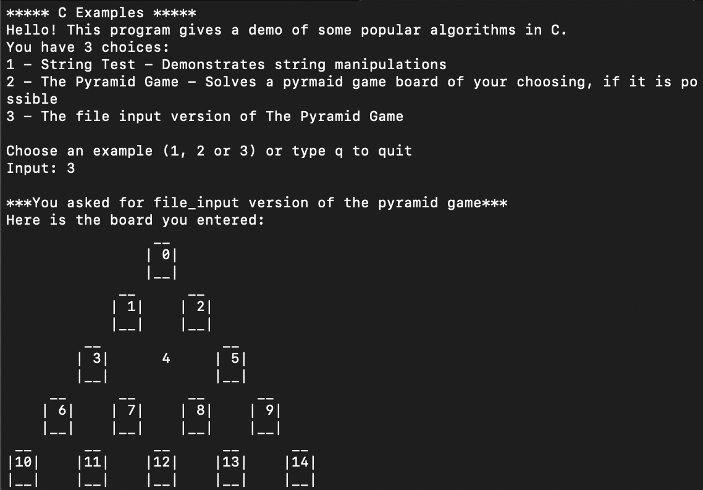

# c-algorithm-examples

This is a pair of examples of algorithms in C.
The first is a demo of string manipulation such as search, reverse and length.
The second and third are variations of the peg board Pyramid game.


## Installation

Download the zip package and extract in a suitable place on your hard drive.

## Usage

Compile the files at the command line using
```
 gcc -o pyramid_game main.c my_pyramid_game.c pyramid_helpers.c my_strings.c main_helpers.c
```
Run the program by entering
```
./pyramid_game
```

## Contributing
Pull requests are welcome. For major changes, please open an issue first to discuss what you would like to change.

Please make sure to update tests as appropriate.

## License
[GPLv3](https://choosealicense.com/licenses/gpl-3.0/)
